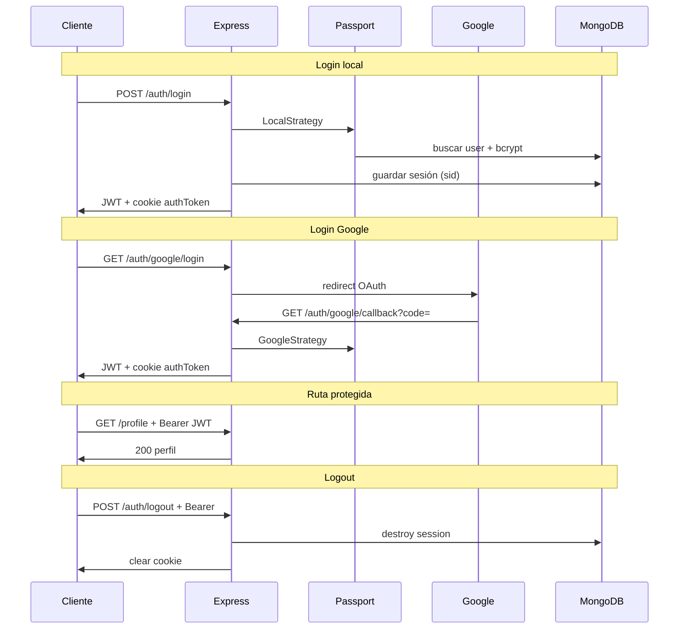

# Backend II — Sistema de autenticación híbrido

API REST en Node.js con **Passport Local**, **Google OAuth 2.0**, **JWT**, **cookies httpOnly** y **sesiones en MongoDB** (`express-session` + `connect-mongo`). Organizada por capas para el proyecto final de Backend.

---

## Presentación del proyecto

| Aspecto | Descripción |
|---------|-------------|
| **Objetivo** | Autenticación híbrida: credenciales locales + OAuth Google, con estado de sesión en servidor y API protegida por JWT y roles. |
| **Stack** | Express 5, Mongoose, Passport, bcrypt, jsonwebtoken, express-session, connect-mongo |
| **Base de datos** | MongoDB (Atlas o local). Colecciones: `users`, `sessions` |
| **Roles** | `user` (default), `admin` |
| **Prefijo API** | `/api/v1` |

### Estrategias implementadas

1. **Registro/login local** — `passport-local` + hash bcrypt + JWT `{ userId, role }`.
2. **Registro/login Google** — `passport-google-oauth20` con rutas separadas (`/google/register` y `/google/login`).
3. **Sesión servidor** — cookie `sid` + documento en MongoDB vía `connect-mongo`.
4. **Autorización** — middleware JWT (`Authorization` o cookie `authToken`) + `requireRole('admin')`.

---

## Estructura del proyecto

```
backend-2/
├── scripts/
│   └── createAdmin.js          # Crea/actualiza usuario admin de prueba
├── src/
│   ├── app.js                  # Entry: dotenv, CORS, session, passport, rutas
│   ├── config/
│   │   ├── db.js               # Conexión Mongoose
│   │   ├── passport.js         # Registro de estrategias + serialize/deserialize
│   │   ├── sessionConfig.js    # express-session + MongoStore
│   │   └── googleOAuth.js      # Lectura/validación vars Google OAuth
│   ├── strategies/
│   │   ├── localStrategy.js    # Passport Local (username/password)
│   │   └── googleStrategy.js   # Passport Google (register vs login)
│   ├── models/
│   │   └── User.js             # Usuario: password, googleSubjectId, role
│   ├── controllers/
│   │   ├── authController.js   # register, login response, logout, session
│   │   └── profileController.js # profile, admin panel
│   ├── middlewares/
│   │   └── auth.js             # isAuthenticated, requireRole (401/403)
│   ├── routes/
│   │   ├── index.js            # Agrupa /auth y rutas protegidas
│   │   ├── authRoutes.js       # auth, OAuth, callback
│   │   └── protectedRoutes.js  # /session, /profile, /admin
│   └── utils/
│       └── authToken.js        # JWT, cookie authToken, expiración
├── .env.example
├── Backend-2-API.postman_collection.json
├── package.json
└── README.md
```

### Capas

| Capa | Responsabilidad |
|------|-----------------|
| **config** | Variables de entorno, DB, sesión, registro Passport |
| **strategies** | Lógica de verificación OAuth/Local (sin HTTP) |
| **models** | Esquema y persistencia de usuarios |
| **controllers** | Reglas de negocio y respuestas JSON |
| **middlewares** | JWT, roles, códigos 401 / 403 |
| **routes** | Endpoints y enlace con Passport |
| **utils** | Firma JWT y opciones de cookies |

---

## Flujo de autenticación (resumen)



---

## Instalación

### Requisitos

- Node.js ≥ 18
- MongoDB (Atlas con IP permitida o local)
- Cuenta Google Cloud (OAuth cliente tipo **Aplicación web**)

### Pasos

```bash
git clone <tu-repo>
cd backend-2
npm install
cp .env.example .env
# Completar .env (ver tabla abajo)
npm run dev
```

Servidor: `http://localhost:3000`

### Scripts npm

| Comando | Descripción |
|---------|-------------|
| `npm run dev` | Inicia la API (`import 'dotenv/config'` en `app.js`) |
| `npm start` | Igual que dev |
| `npm run create-admin` | Usuario `admin_general` / `admin123` (actualiza si ya existe) |

---

## Variables de entorno

Ver `.env.example`. Las obligatorias para funcionar:

| Variable | Uso |
|----------|-----|
| `PORT` | Puerto (default 3000) |
| `NODE_ENV` | `development` \| `production` (afecta cookie `secure`) |
| `MONGO_URI` | Conexión MongoDB |
| `JWT_SECRET` | Firma del JWT |
| `JWT_EXPIRES_IN` | Ej. `1h` (consigna) o `24h` (pruebas locales) |
| `SESSION_SECRET` | Firma de sesión Express |
| `SESSION_TIMEOUT` | `maxAge` sesión y cookie JWT (ms) |
| `BCRYPT_ROUNDS` | Rondas bcrypt en registro |
| `GOOGLE_CLIENT_ID` | Cliente OAuth Web |
| `GOOGLE_CLIENT_SECRET` | Secreto del cliente |
| `GOOGLE_CALLBACK_URL` | Debe coincidir **exacto** con Google Cloud |
| `CLIENT_URL` | Origen CORS del frontend (opcional) |

### Google Cloud

1. Pantalla de consentimiento → **Externo** → usuario de prueba (tu Gmail).
2. Credenciales → **OAuth 2.0 — Aplicación web**.
3. Origen JS: `http://localhost:3000`
4. Redirect URI: `http://localhost:3000/api/v1/auth/google/callback`

Diagnóstico: `GET /api/v1/auth/google/check` y `GET /api/v1/auth/google/debug-auth`

---

## Endpoints

### Auth local

#### `POST /api/v1/auth/register`

```json
// Request
{ "username": "juan", "password": "clave123", "email": "juan@mail.com" }

// Response 201
{
  "message": "Usuario creado con éxito",
  "user": { "userId": "...", "username": "juan", "email": "...", "role": "user" }
}
```

#### `POST /api/v1/auth/login` (Passport Local)

```json
// Request
{ "username": "admin_general", "password": "admin123" }

// Response 200
{
  "message": "Login exitoso",
  "token": "eyJhbGciOiJIUzI1NiIs...",
  "expiresAt": "2026-05-19T12:00:00.000Z",
  "user": { "userId": "...", "username": "...", "role": "admin" }
}
```

Cookie: `authToken` (httpOnly, sameSite: lax, secure solo en producción).

### Google OAuth

| Método | Ruta | Uso |
|--------|------|-----|
| GET | `/api/v1/auth/google/register` | Primera vez — crea usuario |
| GET | `/api/v1/auth/google/login` | Si ya existe cuenta Google |
| GET | `/api/v1/auth/google/callback` | Callback (automático) |

Probar en **navegador**. Copiar el campo **`token`** del JSON (empieza con `eyJ...`), no el `code` de la URL.

### Sesión

#### `GET /api/v1/session`

Requiere sesión Passport activa (cookie `sid` tras login). Ejemplo:

```json
{
  "message": "Sesión activa",
  "session": { "sessionId": "...", "maxAge": 3600000 },
  "user": { "userId": "...", "username": "...", "role": "user" }
}
```

### Rutas protegidas (JWT)

Enviar header: `Authorization: Bearer <token>` o cookie `authToken`.

| Método | Ruta | Auth | Respuesta error |
|--------|------|------|-----------------|
| GET | `/api/v1/profile` | JWT | 401 sin token |
| GET | `/api/v1/admin` | JWT + rol `admin` | 403 si no es admin |

### Logout

#### `POST /api/v1/auth/logout`

- Header: `Authorization: Bearer <token>` (token **recién** obtenido del login).
- Destruye sesión en MongoDB y borra cookies `authToken` y `sid`.

```json
{ "message": "Logout exitoso. Sesión destruida y cookie eliminada." }
```

---

## Seguridad (resumen para documento final)

| Tema | Decisión |
|------|----------|
| **Rol en JWT** | `{ userId, role }` firmado con `JWT_SECRET`. El rol no se confía desde el body del cliente. |
| **Registro público** | No acepta `role: admin` en el body; admin vía script o MongoDB. |
| **CSRF** | Cookies `httpOnly` + `sameSite: lax`; API stateless con Bearer en Postman. En producción: `secure: true`, CORS restringido a `CLIENT_URL`. |
| **Local vs producción** | `NODE_ENV=production` activa cookies `secure`. |
| **Cookie + JWT** | Híbrido: sesión para `GET /session`; JWT para `/profile` y `/admin`. |
| **Rol cambiado** | El JWT sigue con el rol viejo hasta expirar; hay que volver a loguearse. |

---

## Pruebas con Postman

Importar `Backend-2-API.postman_collection.json`.

Orden sugerido:

1. **Register** o **Login Admin** → guarda `token` en variable de colección.
2. **GET Profile** → 200.
3. **GET Admin** (con admin) → 200.
4. **GET Session** (con cookies si hubo login en mismo entorno).
5. **Logout** → 200 con Bearer del paso 1.
6. Google: navegador en `/google/register` o `/google/login` → copiar `token` → Profile / Logout.

---

## Nomenclatura de commits

- `feat:` nueva funcionalidad (ej. `feat: agregar Google OAuth`)
- `fix:` corrección de bugs
- `chore:` configuración (ej. `chore: actualizar .env.example`)
- `docs:` documentación

Flujo Git sugerido: ramas `feature/...` → merge a `main`.

---

## Autor

Emanuel Montenegro — 
[GitHub](https://github.com/emamontenegro)
[LinkedIn](www.linkedin.com/in/emanuel-montenegro-dev)
[Portfolio](https://emanuelmontenegro.dev)

Licencia MIT.
